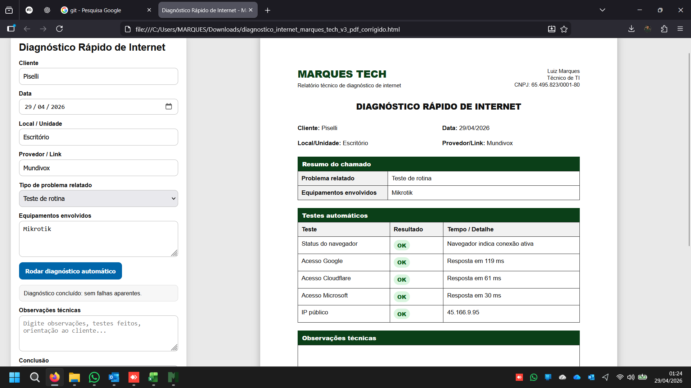

# 🌐 Diagnóstico Rápido de Internet - Marques Tech

Ferramenta web para análise rápida de conectividade e geração de relatório técnico em PDF.

## 🚀 O que faz

### 🔎 Diagnóstico automático
Realiza testes básicos de conectividade para identificar possíveis falhas na rede:

- Status de conexão do dispositivo
- Acesso a múltiplos servidores:
  - Google
  - Cloudflare
  - Microsoft
- Consulta de IP público
- Medição de tempo de resposta (latência)

### 📋 Registro do atendimento
Permite preencher informações do atendimento:

- Cliente
- Data (automática e editável)
- Local / unidade
- Provedor de internet
- Tipo de problema relatado
- Equipamentos envolvidos

### 🧠 Análise técnica
- Campo de observações técnicas
- Campo de conclusão
- Relatório estruturado pronto para envio ao cliente

### 📄 Geração de PDF
- Layout profissional
- Formato A4
- Otimizado para impressão
- Mesma proporção da prévia

---

## 🖥️ Acesso

👉 (coloque aqui o link do seu GitHub Pages)

---

## 📄 Como usar

1. Preencha os dados do atendimento
2. Clique em **Rodar diagnóstico automático**
3. Revise os resultados
4. Adicione observações e conclusão
5. Clique em **Imprimir / salvar PDF**

---

## 🧪 Interpretação dos testes

- **OK** → conexão estável
- **Atenção** → latência elevada (possível instabilidade)
- **Falha** → sem resposta / problema de conectividade

---

## 🖼️ Preview

---

## 📌 Observações

- Os testes são baseados em requisições HTTP (não substituem ferramentas avançadas como ping real)
- Ideal para diagnóstico rápido em atendimento técnico
- Pode ser utilizado diretamente no navegador (sem instalação)

---

## 🎯 Objetivo

Facilitar o diagnóstico de problemas de internet durante atendimentos técnicos, gerando um relatório claro e profissional para o cliente.

---

**Desenvolvido por Marques Tech 🚀**
